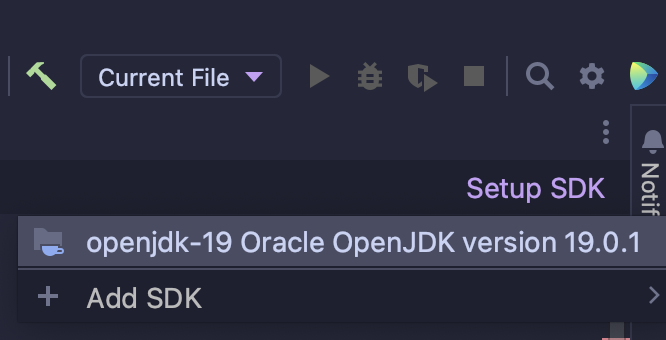

# Exercise 4.2 - 🚏 Queue Array

## 🎯 Objectives

- **Implement** an array-based queue data structure in Java.

## 🔨 Setup

1. Clone the repo (or download the zip) for this exercise, which you can find [here](https://github.com/JAC-CS-Programming-4-W23/E4.2-Queue-Array).
2. Start IntelliJ, go to `File -> Open...`, and select the cloned/downloaded folder.
3. If at the top it says "Project JDK is not defined", click "Setup JDK" on the top right, and select the JDK version you have installed on your machine.

   

4. To get the unit tests to work, open `QueueTest.java` and add JUnit to the classpath:

   

   - Just click "OK" on the resulting dialogue window and all the test-related red squigglies should disappear.

## 🔍 Context

How should we use an array to store a queue? The simplest thing to do is base ourselves on the stack array implementation: store the elements in the lower portion of the array. Here we can put the front at position `0` and the rear in the highest index position:

For example, the queue

would be stored in an array:

## 🚦 Let's Go

Let's set this up:

1. Create a class called `IntQueue`.
2. Add the necessary fields to store queue.
3. Create two constructors: one where the queue `capacity` is provided and one where it is not, relying on a default `QUEUE_CAPACITY`.
4. Implement the methods of the `Queue` API: `enqueue(..)`, `dequeue()`, `front()`, `isEmpty()` and `isFull()`.
5. Throw exception `QueueOverflowException` and `QueueUnderflowException` when the caller has not met the operation preconditions.
6. Pass the unit tests in the class `TestQueue`.

### 👑 Bonus - Queueable Interface

1. Create a `Queueable` interface which includes the necessary methods for a queue.
2. Have your `IntQueue` implement the `Queueable` interface and override all the interface's methods.
3. You can have the interface just use `int`s, but for an extra challenge, can you make it use generics instead?
   - No worries if you can't do this last part because we'll be learning generics later in the semester!

## 🔬 Observations

- Which operation is more efficient and why?
- What is the impact here?

---

